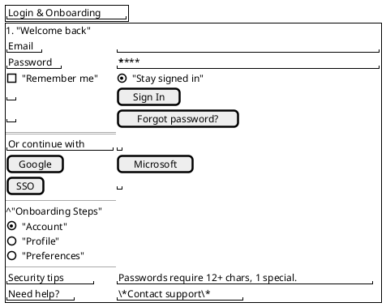
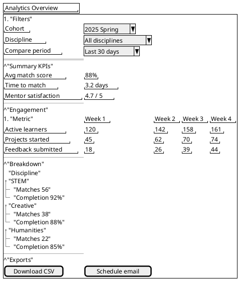
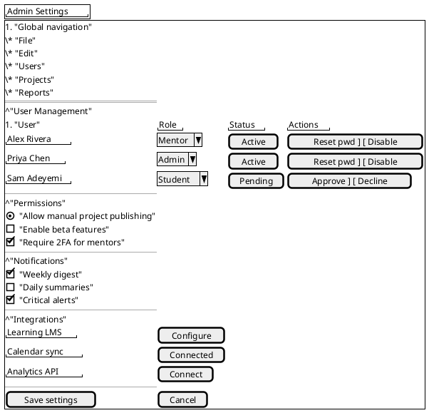

# Project Sigma Wireframes (PlantUML SALT)

Each screen wireframe is provided as an individual PlantUML block. Render a specific screen by copying its fenced code into `plantuml`, for example:

```bash
plantuml -tsvg screen-name.puml
```

or use an online PlantUML renderer. Reference: [PlantUML SALT documentation](https://plantuml.com/salt).

---

## Landing Page – Marketing

```plantuml
@startuml LandingPageMarketing
salt
{
{+"Landing Page – Marketing"}
{#!                        "Illustration Placeholder"
"Match Learners with Ideal Projects"  |  [ Get Started ]
"Personalised matches for every learner" | [ Explore Projects ]
.. | ..
^"Audience"   ^"Educators"^"Students"^"Mentors"^
==
"Trusted by" | "[Logo 1]  [Logo 2]  [Logo 3]  [Logo 4]"
--
^"How it works"
"1 Discover"  |  "2 Match"  | "3 Launch"
[ Learn more ] | [ Watch demo ] | [ Success stories ]
--
"Feature highlights" | "Screenshot placeholder"
". Aligned to learner goals" |
". Smart recommendation scoring" |
". Mentor marketplace integration" |
--
"Stay in the loop" | " "
"Email" | "                                  "
[ Subscribe ] | []
}
}
@enduml
```



## Login & Onboarding



## Recommendation Dashboard

```plantuml
@startuml RecommendationDashboard
salt
{
{+"Recommendation Dashboard"}
{+#  "Header"
"Logo" | "Dashboard" | " " | "Search" | [🔍] | [🔔] | [ ? ] | "Avatar"
==
^"Navigation"
> [ Projects ]
> [* Recommendations *]
> [ Analytics ]
> [ Settings ]
--
[ New Project ]
==
^"Key Metrics"
"Project Matches" | "▲ 5% vs last week"
"Active Learners" | "● 128 online"
"Satisfaction Score" | "★ 4.6 / 5"
==
^"Recommendations"
"Filters" | [ All ] [ STEM ] [ Creative ] [ Humanities ]
"Sort" | ^Suitability^
--
# "Project" | "Suitability" | "Actions"
"Design Thinking Lab" | "92%" | [ View Brief ] [ Save ]
"AI Ethics Debate"   | "88%" | [ View Brief ] [ Saved ]
"Sustainable Cities" | "84%" | [ View Brief ] [ Save ]
--
^"Upcoming Actions"
[ ] "Submit project feedback"
[X] "Schedule mentor session"
[ ] "Review learner portfolio"
--
^"Insights"
"08:45 • Alex saved STEM Lab"
"09:10 • Mentor request pending"
"Need help? " [ View resources ]
}
}
@enduml
```



## Search Results

```plantuml
@startuml SearchResults
salt
{
{+"Search Results"}
{+#  "Search Controls"
"Back" | [ ← ]
"Query" | "Project based learning"
"Filters" | [ Filter Drawer ▾ ]
"Sort" | ^Relevance^
==
^"Filter Drawer"
{!
"Discipline" |
[X] STEM
[] Creative
[] Humanities
--
"Difficulty" |
(X) Beginner
()  Intermediate
()  Advanced
--
"Duration (weeks)" |
"0" | "———●————" | "12"
--
"Tags" |
[ Research ] [ Collaboration ] [ AI ]
--
[ Reset ] | [ Apply ]
}
==
^"Results Grid"
# "Project" | "Match" | "Details" | "Actions"
"BioLab Sprint" | "95%" | "6 weeks · Team" | [ View ] [ Save ]
"Urban Farming" | "87%" | "4 weeks · Solo" | [ View ] [ Saved ]
"Game Design Jam" | "82%" | "8 weeks · Team" | [ View ] [ Save ]
--
"Infinite scroll loading" | [ ▮▮▮▮▮ ]
--
"Empty state (variant)" | "No results. Adjust filters to discover more projects."
}
}
@enduml
```



## Profile Setup

```plantuml
@startuml ProfileSetup
salt
{
{+"Profile Setup"}
{+#^"Step 1 · Basics"
"Full name" | "                                      "
"Preferred pronouns" | ^Select one^
"Time zone" | ^GMT+0^
--
"Bio" | SI "Tell us about your goals
.
.
."
--
[ Continue ] | [ Save draft ]
==
^"Step 2 · Interests"
[X] "Artificial Intelligence"
[]  "Biology & Health"
[X] "Sustainability"
[]  "Humanities"
--
"Learning style"
(X) "Hands-on"
()  "Research-driven"
()  "Collaborative"
--
"Skill confidence"
"Novice" | "●────────────" | "Expert"
==
^"Availability"
[ ] "Weekday mornings"
[X] "Weekday evenings"
[ ] "Weekends"
--
"Reminder preference"
(X) "Email"
()  "SMS"
()  "Push notification"
--
[ Back ] | [ Continue ]
}
}
@enduml
```



## Project Detail

```plantuml
@startuml ProjectDetail
salt
{
{+"Project Detail"}
{+#  "Header"
"Back to results" | [ ← ]
"Project title"   | "Design Thinking Lab"
"Bookmark"        | [ Saved ]
==
^"Tabs"
[ Overview ] [ Scope ] [ Resources ] [ Feedback ]
--
^"Overview"
"Suitability score" | "91% match"
"Duration" | "6 weeks"
"Team size" | "3 – 4 learners"
--
"Objectives" | SI "- Prototype a solution
- Conduct user interviews
- Present findings"
--
"Mentor"
"Alex Rivera" | [ Message ]
==
^"Scope"
# "Week" | "Focus" | "Deliverable"
"1" | "Empathy research" | "Interview summary"
"2" | "Ideation workshop" | "Concept board"
"3" | "Prototyping" | "Lo-fi prototype"
"4" | "Testing" | "Feedback notes"
"5" | "Iteration" | "Refined prototype"
"6" | "Pitch" | "Final presentation"
--
^"Resources"
"/ Home
/ Resources
/ Project Detail"
--
^"Feedback"
"Rating" | "★ ★ ★ ★ ☆"
"Comment" |
"Learners appreciated the cross-disciplinary collaboration."
--
[ Apply to project ] | [ Share ]
}
}
@enduml
```



## Analytics Overview



## Admin Settings



---

### Shared Notes

- Typography: Header 24 pt Open Sans SemiBold `#101828`, body 14 pt Regular `#475467`.
- Interactions: Buttons use sentence case, filter pills toggle datasets, hover/focus states documented in Figma spec.
- Accessibility: Minimum target 44 × 44 px, primary blue `#2A5BFF` passes contrast, keyboard order annotated per screen.
- Documentation: Export SVG/PNG for reporting, link annotations to requirement IDs.

