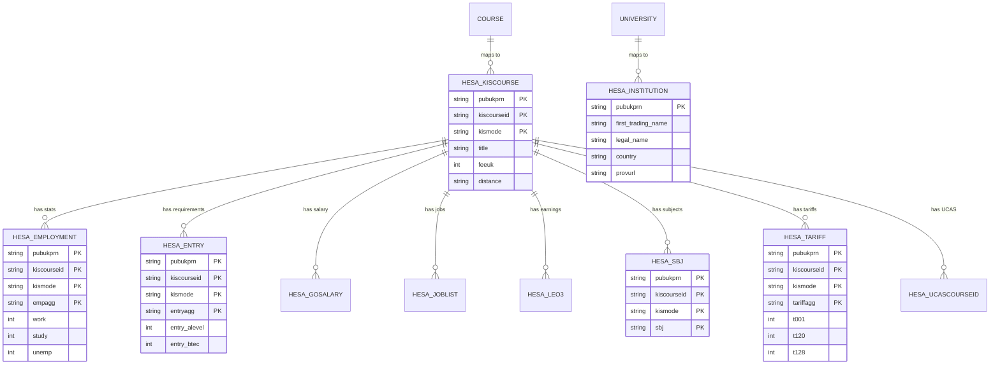

# Design

## 1. System Architecture

### 1.1 High-Level Architecture

```
┌─────────────────────────────────────────────────────────────┐
│                        CLIENT (Browser)                      │
│  ┌────────────────────────────────────────────────────────┐ │
│  │         React/Next.js Frontend (Port 3000)             │ │
│  │  - Dashboard, ProfileSetup, RecommendationResults     │ │
│  │  - TypeScript, Tailwind CSS                           │ │
│  └────────────────────────────────────────────────────────┘ │
└─────────────────────────────────────────────────────────────┘
                              │
                         HTTP/REST API
                              │
┌─────────────────────────────────────────────────────────────┐
│                   FLASK SERVER (Port 5000)                   │
│  ┌────────────────────────────────────────────────────────┐ │
│  │              Python Backend API                        │ │
│  │  - recommendation_engine.py (weighted scoring)         │ │
│  │  - scoring_components.py (individual scores)           │ │
│  │  - routes/ (API endpoints)                             │ │
│  └────────────────────────────────────────────────────────┘ │
└─────────────────────────────────────────────────────────────┘
                              │
                         SQL Queries
                              │
┌─────────────────────────────────────────────────────────────┐
│               POSTGRESQL DATABASE (Port 5432)                │
│  ┌────────────────────────────────────────────────────────┐ │
│  │  Application Tables:                                   │ │
│  │  - university, course, user, user_preference           │ │
│  │  - course_requirement, user_feedback                   │ │
│  │                                                        │ │
│  │  HESA Tables:                                          │ │
│  │  - hesa_institution, hesa_kiscourse                   │ │
│  │  - hesa_employment, hesa_entry, hesa_gosalary         │ │
│  │  - hesa_joblist, hesa_leo3                            │ │
│  └────────────────────────────────────────────────────────┘ │
└─────────────────────────────────────────────────────────────┘
```

**Justification:**
- **Three-tier architecture:** Separates presentation (React), logic (Flask), data (PostgreSQL)
- **RESTful API:** Stateless, scalable, follows industry standards
- **Client-side rendering:** Fast, interactive UI with Next.js
- **Relational database:** Appropriate for structured HESA data with complex relationships

### 1.2 Physical System Architecture (Folder Structure)

The system is organized into a clear, modular structure following industry best practices:

```
projectsigma/
├── .git/                   # Git version control
├── venv/                   # Python virtual environment
│
├── data/                   # 📊 HESA Source Data (10 CSV files)
│   ├── INSTITUTION.csv     # 478 UK universities
│   ├── KISCOURSE.csv       # 30,835 university courses
│   ├── EMPLOYMENT.csv      # Graduate employment statistics
│   ├── ENTRY.csv           # Course entry requirements
│   ├── GOSALARY.csv        # Graduate salary data
│   ├── JOBLIST.csv         # Job destinations for graduates
│   ├── LEO3.csv            # Longitudinal Education Outcomes
│   ├── SBJ.csv             # Subject classifications
│   ├── TARIFF.csv          # UCAS tariff points
│   └── UCASCOURSEID.csv    # UCAS course identifiers
│
├── server/                 # 🐍 Backend Application (Python/Flask)
│   ├── app.py              # Main Flask API (12 endpoints)
│   ├── recommendation_engine.py    # Core recommendation algorithm
│   ├── scoring_components.py       # OOP scoring system (composition)
│   ├── database_helper.py          # PostgreSQL utilities
│   ├── validators.py               # Input validation
│   │
│   ├── models/             # OOP Data Models (Inheritance & Polymorphism)
│   │   ├── base_model.py   # Abstract base class (ABC pattern)
│   │   ├── student.py      # Student model (inherits BaseModel)
│   │   └── course.py       # Course model (inherits BaseModel)
│   │
│   ├── database/           # Database Setup & Migrations
│   │   ├── setup_database.py       # Single-command automated setup
│   │   ├── import_discover_uni_csv.py  # HESA data import
│   │   ├── map_hesa_to_main_tables.py  # Data mapping
│   │   └── migrations/     # SQL schema files
│   │       ├── 001_initial_schema.sql
│   │       └── 002_discover_uni_data_schema.sql
│   │
│   └── tests/              # Comprehensive Test Suite (43 tests)
│       ├── test_recommendation_engine.py  # Algorithm unit tests
│       ├── test_api.py                    # API integration tests
│       ├── test_models.py                 # Model validation tests
│       └── test_oop_features.py           # OOP pattern tests
│
├── client/                 # ⚛️ Frontend Application (React/Next.js)
│   ├── app/                # Next.js 14 App Router
│   │   ├── page.tsx        # Landing page
│   │   ├── layout.tsx      # Root layout
│   │   └── auth/           # Authentication pages
│   │
│   ├── components/         # React Components (17 total)
│   │   ├── Dashboard.tsx
│   │   ├── RecommendationResults.tsx
│   │   ├── ProfileSetup.tsx
│   │   └── auth/           # Auth components
│   │
│   ├── contexts/           # React Context (State Management)
│   │   ├── AuthContext.tsx
│   │   └── QueryContext.tsx
│   │
│   └── lib/
│       └── api.ts          # API client functions
│
└── docs/                   # 📚 Project Documentation
    ├── nea/                # NEA Submission Documents
    │   ├── 00_PROJECT_OVERVIEW.md
    │   ├── 01_ANALYSIS.md
    │   ├── 02_DESIGN.md
    │   ├── 03_DEVELOPMENT.md
    │   ├── 04_TESTING.md
    │   └── 05_EVALUATION.md
    │
    ├── modules/            # Code Documentation
    │   ├── recommendation_engine.md
    │   ├── app.md
    │   └── models.md
    │
    └── database/           # Database Documentation
        ├── SETUP_GUIDE.md
        └── README.md
```

**Design Rationale for Physical Structure:**

1. **Separation of Concerns**
   - `data/` contains raw source data (read-only)
   - `server/` handles all backend logic and API
   - `client/` manages presentation layer
   - `docs/` keeps documentation separate from code

2. **Modularity & Maintainability**
   - `server/models/` groups OOP classes together
   - `server/database/` isolates database operations
   - `server/tests/` co-locates tests with backend code
   - `client/components/` organizes reusable UI elements

3. **Professional Standards**
   - Follows Flask best practices (flat structure for small-medium apps)
   - Follows Next.js 14 App Router conventions
   - Uses standard naming (`tests/`, `database/`, `components/`)

4. **Scalability**
   - Easy to add new API endpoints in `app.py`
   - New models added to `models/` folder
   - New React components in `components/` folder
   - Database schema maintained in `setup_database.py`

5. **Evidence of Advanced Programming**
   - `models/` folder demonstrates OOP (inheritance, abstraction)
   - `tests/` folder shows test-driven development
   - `scoring_components.py` demonstrates composition pattern
   - Database triggers/constraints show advanced SQL knowledge

This structure ensures that each component can be:
- **Developed independently** (e.g., frontend team works in `client/`)
- **Tested in isolation** (e.g., unit tests in `tests/`)
- **Deployed separately** (e.g., API and frontend on different servers)
- **Maintained easily** (e.g., clear responsibility boundaries)

### 1.3 Data Flow Diagram

[Create a DFD showing:
- User inputs (grades, interests, preferences)
- Processing (recommendation engine, scoring components)
- Data stores (database tables)
- Outputs (recommended courses, details)]

---

## 2. Database Design

### 2.1 Overview

The database consists of **25 tables** organized into three layers:
- **14 Application Tables** - Core business logic (students, courses, recommendations)
- **10 HESA Tables** - Raw HESA data import (institutions, courses, outcomes)
- **1 System Table** - Migration tracking

**Key Design Decisions:**
1. **1NF Compliance:** Removed TEXT[] arrays, created junction tables for many-to-many relationships
2. **Data Integrity:** UNIQUE constraint on HESA identifiers (pubukprn, kiscourseid, kismode)
3. **Automation:** PostgreSQL triggers for automatic `updated_at` timestamps
4. **Referential Integrity:** Foreign keys with CASCADE/RESTRICT policies

### 2.1 Entity-Relationship Diagram (ERD)

#### Application Layer - Core Entities


#### HESA Data Layer - External Data Sources



**Diagram Notes:**
- **PK** = Primary Key
- **FK** = Foreign Key  
- **UK** = Unique Key
- **||--o{** = One-to-Many relationship
- Composite keys shown with multiple PK annotations

### 2.2 Table Schemas (Updated December 2025)

#### Application Tables (14 tables)

**student** (Normalized - arrays removed for 1NF compliance)
```sql
CREATE TABLE student (
    student_id VARCHAR(50) PRIMARY KEY,
    display_name VARCHAR(255) NOT NULL,
    email VARCHAR(255) UNIQUE NOT NULL,
    password_hash VARCHAR(255) NOT NULL,
    created_at DATE DEFAULT CURRENT_DATE,
    region VARCHAR(100),
    tuition_budget INTEGER,
    updated_at TIMESTAMP DEFAULT CURRENT_TIMESTAMP  -- Trigger updates this
);
```

**subject**
```sql
CREATE TABLE subject (
    subject_id VARCHAR(50) PRIMARY KEY,
    subject_name VARCHAR(255) NOT NULL UNIQUE
);
```

**student_grade** (Junction table with composite PK)
```sql
CREATE TABLE student_grade (
    student_id VARCHAR(50) REFERENCES student(student_id) ON DELETE CASCADE,
    subject_id VARCHAR(50) REFERENCES subject(subject_id) ON DELETE RESTRICT,
    predicted_grade VARCHAR(5) NOT NULL CHECK (predicted_grade IN ('A*', 'A', 'B', 'C', 'D', 'E', 'U')),
    PRIMARY KEY (student_id, subject_id)
);
```

**career_interest** (Lookup table - seeded by seed_career_interests.py)
```sql
CREATE TABLE career_interest (
    career_interest_id VARCHAR(50) PRIMARY KEY,
    name VARCHAR(255) NOT NULL UNIQUE
);
-- Data: 10 career categories (Healthcare, Engineering, Business, Law, etc.)
```

**student_career_interest** (Junction table - many-to-many, 1NF compliant)
```sql
CREATE TABLE student_career_interest (
    student_id VARCHAR(50) REFERENCES student(student_id) ON DELETE CASCADE,
    career_interest_id VARCHAR(50) REFERENCES career_interest(career_interest_id) ON DELETE CASCADE,
    PRIMARY KEY (student_id, career_interest_id)
);
```

**entrance_exam** (Lookup table)
```sql
CREATE TABLE entrance_exam (
    exam_id VARCHAR(50) PRIMARY KEY,
    name VARCHAR(255) NOT NULL UNIQUE
);
-- Data: 5 exam types (A-Level, BTEC, IB, Scottish Highers, Access Course)
```

**student_preferred_exam** (Junction table - many-to-many, 1NF compliant)
```sql
CREATE TABLE student_preferred_exam (
    student_id VARCHAR(50) REFERENCES student(student_id) ON DELETE CASCADE,
    exam_id VARCHAR(50) REFERENCES entrance_exam(exam_id) ON DELETE CASCADE,
    PRIMARY KEY (student_id, exam_id)
);
```

**university**
```sql
CREATE TABLE university (
    university_id VARCHAR(50) PRIMARY KEY,
    name VARCHAR(255) NOT NULL,
    region VARCHAR(100),
    rank_overall INTEGER,
    employability_score INTEGER CHECK (employability_score BETWEEN 0 AND 100),
    website_url VARCHAR(500),
    created_at TIMESTAMP DEFAULT CURRENT_TIMESTAMP,
    updated_at TIMESTAMP DEFAULT CURRENT_TIMESTAMP  -- Trigger updates this
);
```

**course** (Updated with UNIQUE constraint on HESA identifiers)
```sql
CREATE TABLE course (
    course_id VARCHAR(255) PRIMARY KEY,
    university_id VARCHAR(255) REFERENCES university(university_id) ON DELETE CASCADE,
    ucas_code VARCHAR(20) UNIQUE,
    name VARCHAR(255) NOT NULL,
    annual_fee INTEGER,
    employability_score INTEGER,
    duration_years DECIMAL(3,1),
    distance_learning VARCHAR(1),
    pubukprn VARCHAR(8),      -- HESA link
    kiscourseid VARCHAR(50),  -- HESA link
    kismode VARCHAR(2),       -- HESA link
    created_at TIMESTAMP DEFAULT CURRENT_TIMESTAMP,
    updated_at TIMESTAMP DEFAULT CURRENT_TIMESTAMP,
    UNIQUE (pubukprn, kiscourseid, kismode)  -- ✅ Prevents duplicate HESA courses
);
```

**course_requirement**
```sql
CREATE TABLE course_requirement (
    req_id VARCHAR(50) PRIMARY KEY,
    course_id VARCHAR(50) REFERENCES course(course_id) ON DELETE CASCADE,
    subject_id VARCHAR(50) REFERENCES subject(subject_id) ON DELETE RESTRICT,
    grade_req VARCHAR(5) NOT NULL CHECK (grade_req IN ('A*', 'A', 'B', 'C', 'D', 'E'))
);
```

**course_required_exam**
```sql
CREATE TABLE course_required_exam (
    course_id VARCHAR(50) REFERENCES course(course_id) ON DELETE CASCADE,
    exam_id VARCHAR(50) REFERENCES entrance_exam(exam_id) ON DELETE CASCADE,
    PRIMARY KEY (course_id, exam_id)
);
```

**recommendation_run**
```sql
CREATE TABLE recommendation_run (
    run_id VARCHAR(50) PRIMARY KEY,
    student_id VARCHAR(50) REFERENCES student(student_id) ON DELETE CASCADE,
    run_at TIMESTAMP DEFAULT CURRENT_TIMESTAMP,
    filter_region VARCHAR(100),
    filter_max_fee INTEGER
);
```

**recommendation_result**
```sql
CREATE TABLE recommendation_result (
    result_id VARCHAR(50) PRIMARY KEY,
    run_id VARCHAR(50) REFERENCES recommendation_run(run_id) ON DELETE CASCADE,
    course_id VARCHAR(50) REFERENCES course(course_id) ON DELETE CASCADE,
    match_score DECIMAL(5,2) NOT NULL CHECK (match_score BETWEEN 0 AND 100),
    rank INTEGER NOT NULL
);
```

**subject_to_career** (Derived/lookup table - seeded by subject_to_career_mapping.py)
```sql
CREATE TABLE subject_to_career (
    sbj VARCHAR(50) PRIMARY KEY,  -- CAH subject code
    career_interest_id VARCHAR(50) REFERENCES career_interest(career_interest_id)
);
-- Maps 21 CAH subject codes to 10 career categories
```

#### HESA Tables (10 tables - imported from 10 CSV files)

**hesa_institution** (478 UK universities)
```sql
CREATE TABLE hesa_institution (
    pubukprn VARCHAR(8) PRIMARY KEY,        -- UK Provider Reference Number
    first_trading_name VARCHAR(255),
    legal_name VARCHAR(255),
    country VARCHAR(10),
    provurl VARCHAR(500)                     -- University website
);
```

**hesa_kiscourse** (30,835 courses - composite PK)
```sql
CREATE TABLE hesa_kiscourse (
    pubukprn VARCHAR(8) NOT NULL,
    ukprn VARCHAR(8) NOT NULL,
    kiscourseid VARCHAR(50) NOT NULL,
    kismode VARCHAR(2) NOT NULL,             -- 01=Full-time, 02=Part-time
    title VARCHAR(255) NOT NULL,
    titlew VARCHAR(255),                     -- Welsh translation
    length VARCHAR(50),
    levelcode VARCHAR(10),
    distance VARCHAR(1),                     -- Distance learning flag
    feeuk INTEGER,                           -- UK student fees
    feeeng INTEGER,                          -- English student fees
    PRIMARY KEY (pubukprn, kiscourseid, kismode)
);
```

**hesa_employment** (Graduate employment outcomes)
```sql
CREATE TABLE hesa_employment (
    pubukprn VARCHAR(8) NOT NULL,
    ukprn VARCHAR(8) NOT NULL,
    kiscourseid VARCHAR(50) NOT NULL,
    kismode VARCHAR(2) NOT NULL,
    empagg VARCHAR(2) NOT NULL,              -- Employment aggregation
    work INTEGER,                            -- % in employment
    study INTEGER,                           -- % in further study
    unemp INTEGER,                           -- % unemployed
    workstudy INTEGER,                       -- % work & study
    PRIMARY KEY (pubukprn, kiscourseid, kismode, empagg)
);
```

**hesa_entry** (Course entry requirements)
```sql
CREATE TABLE hesa_entry (
    pubukprn VARCHAR(8) NOT NULL,
    ukprn VARCHAR(8) NOT NULL,
    kiscourseid VARCHAR(50) NOT NULL,
    kismode VARCHAR(2) NOT NULL,
    entryagg VARCHAR(2) NOT NULL,            -- Entry aggregation
    alevel INTEGER,                          -- % A-Level entrants
    btec INTEGER,                            -- % BTEC entrants
    ib INTEGER,                              -- % IB entrants
    foundation INTEGER,                      -- % Foundation course entrants
    PRIMARY KEY (pubukprn, kiscourseid, kismode, entryagg)
);
```

**hesa_gosalary** (Graduate salary data - 6 months post-graduation)
```sql
CREATE TABLE hesa_gosalary (
    pubukprn VARCHAR(8) NOT NULL,
    ukprn VARCHAR(8) NOT NULL,
    kiscourseid VARCHAR(50) NOT NULL,
    kismode VARCHAR(2) NOT NULL,
    salagg VARCHAR(2) NOT NULL,              -- Salary aggregation
    lq INTEGER,                              -- Lower quartile salary
    med INTEGER,                             -- Median salary
    uq INTEGER,                              -- Upper quartile salary
    instmed INTEGER,                         -- Institution median
    PRIMARY KEY (pubukprn, kiscourseid, kismode, salagg)
);
```

**hesa_joblist** (Graduate job destinations)
```sql
CREATE TABLE hesa_joblist (
    pubukprn VARCHAR(8) NOT NULL,
    ukprn VARCHAR(8) NOT NULL,
    kiscourseid VARCHAR(50) NOT NULL,
    kismode VARCHAR(2) NOT NULL,
    jobagg VARCHAR(2) NOT NULL,              -- Job aggregation
    job VARCHAR(10) NOT NULL,                -- SOC job code
    joborder INTEGER,                        -- Job ranking
    perc INTEGER,                            -- % in this job type
    PRIMARY KEY (pubukprn, kiscourseid, kismode, jobagg, job)
);
```

**hesa_leo3** (Longitudinal Education Outcomes - 3 years post-graduation)
```sql
CREATE TABLE hesa_leo3 (
    pubukprn VARCHAR(8) NOT NULL,
    ukprn VARCHAR(8) NOT NULL,
    kiscourseid VARCHAR(50) NOT NULL,
    kismode VARCHAR(2) NOT NULL,
    leo3agg VARCHAR(2) NOT NULL,             -- LEO aggregation
    earnings_lq INTEGER,                     -- Lower quartile earnings
    earnings_med INTEGER,                    -- Median earnings
    earnings_uq INTEGER,                     -- Upper quartile earnings
    PRIMARY KEY (pubukprn, kiscourseid, kismode, leo3agg)
);
```

**hesa_sbj** (Subject codes - CAH classification)
```sql
CREATE TABLE hesa_sbj (
    pubukprn VARCHAR(8) NOT NULL,
    ukprn VARCHAR(8) NOT NULL,
    kiscourseid VARCHAR(50) NOT NULL,
    kismode VARCHAR(2) NOT NULL,
    sbj VARCHAR(50) NOT NULL,                -- CAH subject code
    PRIMARY KEY (pubukprn, kiscourseid, kismode, sbj)
);
```

**hesa_tariff** (UCAS tariff point distributions)
```sql
CREATE TABLE hesa_tariff (
    pubukprn VARCHAR(8) NOT NULL,
    ukprn VARCHAR(8) NOT NULL,
    kiscourseid VARCHAR(50) NOT NULL,
    kismode VARCHAR(2) NOT NULL,
    tariffagg VARCHAR(2) NOT NULL,           -- Tariff aggregation
    t001 INTEGER,                            -- % with 0-79 points
    t120 INTEGER,                            -- % with 80-119 points
    t128 INTEGER,                            -- % with 120-159 points
    t144 INTEGER,                            -- % with 160+ points
    PRIMARY KEY (pubukprn, kiscourseid, kismode, tariffagg)
);
```

**hesa_ucascourseid** (UCAS course identifiers)
```sql
CREATE TABLE hesa_ucascourseid (
    pubukprn VARCHAR(8) NOT NULL,
    ukprn VARCHAR(8) NOT NULL,
    kiscourseid VARCHAR(50) NOT NULL,
    kismode VARCHAR(2) NOT NULL,
    ucasprogid VARCHAR(10) NOT NULL,         -- UCAS programme code
    PRIMARY KEY (pubukprn, kiscourseid, kismode, ucasprogid)
);
```

#### System Table (1 table)

**schema_migrations** (Database version tracking)
```sql
CREATE TABLE schema_migrations (
    version VARCHAR(255) PRIMARY KEY,
    applied_at TIMESTAMP DEFAULT CURRENT_TIMESTAMP
);
```

### 2.3 Normalization & Design Principles

#### First Normal Form (1NF) Compliance

**Problem Identified:** Original design violated 1NF with TEXT[] arrays:
```sql
-- ❌ BEFORE: Violates 1NF
CREATE TABLE student (
    preferred_exams TEXT[],        -- Array = 1NF violation
    career_interests TEXT[]        -- Array = 1NF violation
);
```

**Solution Implemented:** Junction tables for many-to-many relationships:
```sql
-- ✅ AFTER: 1NF Compliant
CREATE TABLE student_preferred_exam (
    student_id VARCHAR(50),
    exam_id VARCHAR(50),
    PRIMARY KEY (student_id, exam_id)
);

CREATE TABLE student_career_interest (
    student_id VARCHAR(50),
    career_interest_id VARCHAR(50),
    PRIMARY KEY (student_id, career_interest_id)
);
```

**Benefits:**
- ✅ Referential integrity with foreign keys
- ✅ Efficient querying: `JOIN student_career_interest sci ON sci.career_interest_id = 'healthcare'`
- ✅ Scalable: Add unlimited career interests per student
- ✅ AQA Group A skill: "Complex data model in database (e.g. several interlinked tables)"

#### Data Integrity Constraints

**UNIQUE Constraints:**
```sql
-- Prevents duplicate HESA course imports
UNIQUE (pubukprn, kiscourseid, kismode) ON course

-- Prevents duplicate career/exam names
UNIQUE (name) ON career_interest
UNIQUE (name) ON entrance_exam
```

**CHECK Constraints:**
```sql
-- Grade validation
CHECK (predicted_grade IN ('A*', 'A', 'B', 'C', 'D', 'E', 'U'))
CHECK (employability_score BETWEEN 0 AND 100)
```

**Foreign Key Policies:**
- `CASCADE`: When parent deleted, children deleted (e.g., student → student_grades)
- `RESTRICT`: Prevent deletion if children exist (e.g., subject → course_requirements)

#### Database Automation (PostgreSQL Triggers)

**Automatic Timestamp Updates:**
```sql
CREATE OR REPLACE FUNCTION update_updated_at_column()
RETURNS TRIGGER AS $$
BEGIN
    NEW.updated_at = CURRENT_TIMESTAMP;
    RETURN NEW;
END;
$$ LANGUAGE plpgsql;

CREATE TRIGGER update_course_updated_at
BEFORE UPDATE ON course
FOR EACH ROW
EXECUTE FUNCTION update_updated_at_column();
```

**Demonstrates:**
- ✅ AQA Group A skill: Database triggers
- ✅ Advanced PostgreSQL features (plpgsql)
- ✅ Automated data maintenance

### 2.4 Data Dictionary
- Source (if HESA data)]

---

## 3. Algorithm Design

### 3.1 Recommendation Algorithm (Weighted Scoring)

**Purpose:** Calculate a personalized score for each course based on user preferences and course attributes.

**Inputs:**
- User profile: predicted grades, career interests, location preferences
- Course data: employability, fees, entry requirements, location
- HESA data: employment outcomes, salaries, graduate destinations

**Algorithm Pseudocode:**

```
FUNCTION calculate_recommendation_score(user, course):
    // Initialize weights (sum to 1.0)
    weights = {
        'location': 0.15,
        'employability': 0.25,
        'career_alignment': 0.20,
        'entry_requirements': 0.20,
        'fees': 0.10,
        'graduate_salary': 0.10
    }
    
    // Calculate individual component scores (0-100)
    location_score = score_location(user.preferred_regions, course.region)
    employability_score = course.employability_score
    career_score = score_career_alignment(user.career_interests, course.job_types)
    entry_score = score_entry_requirements(user.grades, course.requirements)
    fee_score = score_fees(user.max_fee, course.annual_fee)
    salary_score = normalize_salary(course.leo3_median)
    
    // Calculate weighted sum
    total_score = (
        weights['location'] * location_score +
        weights['employability'] * employability_score +
        weights['career_alignment'] * career_score +
        weights['entry_requirements'] * entry_score +
        weights['fees'] * fee_score +
        weights['graduate_salary'] * salary_score
    )
    
    RETURN total_score (0-100)
END FUNCTION
```

**Justification:**
- Weighted scoring allows balancing multiple criteria
- Transparent and explainable (vs. black-box ML)
- Weights can be tuned based on user feedback
- Efficient: O(n) complexity for n courses

### 3.2 Scoring Component Algorithms

#### 3.2.1 Location Scoring

```
FUNCTION score_location(preferred_regions, course_region):
    IF course_region IN preferred_regions:
        RETURN 100
    ELSE:
        RETURN 50  // Neutral score for non-preferred regions
    END IF
END FUNCTION
```

#### 3.2.2 Career Alignment Scoring

```
FUNCTION score_career_alignment(user_interests, course_job_types):
    // user_interests: ['Software Developer', 'Data Analyst']
    // course_job_types: [{'job': 'Programmer', 'percentage': 35}, ...]
    
    total_alignment = 0
    
    FOR EACH interest IN user_interests:
        FOR EACH job_type IN course_job_types:
            IF interest SIMILAR TO job_type.job:  // Fuzzy matching
                total_alignment += job_type.percentage
            END IF
        END FOR
    END FOR
    
    // Normalize to 0-100
    RETURN MIN(total_alignment, 100)
END FUNCTION
```

#### 3.2.3 Entry Requirements Scoring

```
FUNCTION score_entry_requirements(user_grades, course_requirements):
    user_points = calculate_ucas_points(user_grades)
    course_points = course_requirements.typical_ucas_points
    
    IF user_points >= course_points:
        // Exceed requirements: perfect score
        RETURN 100
    ELSE IF user_points >= course_points * 0.9:
        // Close to requirements: high score
        RETURN 80
    ELSE IF user_points >= course_points * 0.8:
        // Slightly below: medium score
        RETURN 60
    ELSE:
        // Significantly below: low score
        RETURN 30
    END IF
END FUNCTION
```

### 3.3 Data Mapping Algorithm

**Purpose:** Map HESA raw data (institution, kiscourse) to application tables (university, course)

**Process:**
1. Read `hesa_institution` table
2. For each institution:
   - Generate university_id
   - Extract name, region, website URL
   - Insert into `university` table
3. Read `hesa_kiscourse` table (5000 courses)
4. For each course:
   - Find matching university (via pubukprn)
   - Lookup employment data from `hesa_employment`
   - Calculate employability score
   - Extract entry requirements from `hesa_entry`
   - Insert into `course` and `course_requirement` tables

[See implementation in `server/database/map_hesa_to_main_tables.py`]

---

## 4. User Interface Design

### 4.1 Wireframes

#### 4.1.1 Landing Page

```
┌─────────────────────────────────────────────────────────┐
│  [Logo] Project Sigma       [Login] [Sign Up]          │
├─────────────────────────────────────────────────────────┤
│                                                         │
│           Find Your Perfect University Course            │
│                                                         │
│     [Personalized recommendations based on your         │
│      grades, interests, and career goals]               │
│                                                         │
│              [Get Started →]                            │
│                                                         │
│  Features:                                              │
│  ✓ 5000+ UK university courses                         │
│  ✓ Real employment outcomes                            │
│  ✓ Graduate salary data                                │
│  ✓ Personalized matching                               │
└─────────────────────────────────────────────────────────┘
```

#### 4.1.2 Profile Setup Page

```
┌─────────────────────────────────────────────────────────┐
│  [Back] Profile Setup                           [Save]  │
├─────────────────────────────────────────────────────────┤
│                                                         │
│  Step 1: Your Predicted A-Level Grades                 │
│  ┌───────────────────────────────────────────────────┐ │
│  │ Subject 1: [Mathematics    ▼] Grade: [A*▼]       │ │
│  │ Subject 2: [Computer Sci   ▼] Grade: [A ▼]       │ │
│  │ Subject 3: [Physics        ▼] Grade: [A ▼]       │ │
│  └───────────────────────────────────────────────────┘ │
│                                                         │
│  Step 2: Career Interests (select up to 3)             │
│  ┌───────────────────────────────────────────────────┐ │
│  │ [x] Software Developer                            │ │
│  │ [ ] Data Analyst                                  │ │
│  │ [ ] Cybersecurity Specialist                      │ │
│  │ [x] AI/Machine Learning Engineer                  │ │
│  └───────────────────────────────────────────────────┘ │
│                                                         │
│  Step 3: Location Preferences                          │
│  ┌───────────────────────────────────────────────────┐ │
│  │ [x] England  [x] Scotland  [ ] Wales  [ ] NI      │ │
│  └───────────────────────────────────────────────────┘ │
│                                                         │
│  Step 4: Financial Considerations                      │
│  ┌───────────────────────────────────────────────────┐ │
│  │ Maximum annual fee: £[9250] ───────────────────   │ │
│  └───────────────────────────────────────────────────┘ │
│                                                         │
│                    [Get Recommendations →]             │
└─────────────────────────────────────────────────────────┘
```

#### 4.1.3 Recommendations Dashboard

```
┌───────────────────────────────────────────────────────────┐
│ [Home] Your Recommendations                  [Profile] [⚙] │
├───────────────────────────────────────────────────────────┤
│ Filters: [Location▼] [Fees▼] [Entry▼]     [Sort: Match▼] │
├───────────────────────────────────────────────────────────┤
│                                                           │
│  ┌────────────────────────────────────────────────────┐  │
│  │ 1. BSc Computer Science - University of Example    │  │
│  │    Match: 92%  ████████████░                       │  │
│  │    📍 England  💰 £9,250/year  📊 Employability: 95% │  │
│  │    Entry: AAA   Median Salary: £35,000             │  │
│  │    [View Details] [Compare] [Save]                 │  │
│  └────────────────────────────────────────────────────┘  │
│                                                           │
│  ┌────────────────────────────────────────────────────┐  │
│  │ 2. BSc Software Engineering - Example Tech Uni     │  │
│  │    Match: 89%  ███████████░░                       │  │
│  │    📍 Scotland  💰 £9,250/year  📊 Employability: 92% │  │
│  │    Entry: AAB   Median Salary: £33,500             │  │
│  │    [View Details] [Compare] [Save]                 │  │
│  └────────────────────────────────────────────────────┘  │
│                                                           │
│  [Load More Results...]                                   │
└───────────────────────────────────────────────────────────┘
```

### 4.2 UI Component Breakdown

[List React components and their responsibilities:
- Header.tsx: Navigation, user menu
- Dashboard.tsx: Main recommendations view
- ProfileSetup.tsx: Multi-step form
- CourseDetailsModal.tsx: Detailed course information
- ProjectCard.tsx: Individual course card
- RecommendationResults.tsx: Results list]

### 4.3 User Journey Map

1. User arrives → Landing page
2. Click "Get Started" → Profile setup
3. Enter grades, interests, preferences → Submit
4. Algorithm runs → Dashboard shows recommendations
5. Browse results → Click course card
6. View detailed outcomes → Modal with employment data
7. Save preferred courses → User profile updated

---

## 5. Test Plan

### 5.1 Unit Tests

| Test ID | Component | Test Description | Expected Result |
|---------|-----------|------------------|-----------------|
| UT1 | score_location() | Test scoring with preferred region | Return 100 |
| UT2 | score_location() | Test scoring with non-preferred region | Return 50 |
| UT3 | calculate_ucas_points() | Test A*AA grades | Return 144 |
| UT4 | score_entry_requirements() | User points >= course points | Return 100 |
| UT5 | score_career_alignment() | Exact career match | Return ≥ 80 |
| UT6 | normalize_salary() | £35,000 median salary | Return normalized 0-100 |
| UT7 | generate_id() | Generate unique ID | Return 'UNIV_' prefix ID |

### 5.2 Integration Tests

| Test ID | Integration | Test Description | Expected Result |
|---------|-------------|------------------|-----------------|
| IT1 | Database → Backend | Query courses by UCAS code | Return correct course object |
| IT2 | Backend → Frontend | GET /api/recommendations | Return JSON array of courses |
| IT3 | HESA Mapping | Map institution to university | University row created in DB |
| IT4 | Scoring → Results | Generate scores for 100 courses | All courses have valid scores |
| IT5 | User Input → Profile | Save user preferences | Preferences stored in DB |

### 5.3 System Tests

| Test ID | Feature | Test Description | Expected Result |
|---------|---------|------------------|-----------------|
| ST1 | End-to-end flow | Complete user journey (landing → profile → results) | Success |
| ST2 | Performance | Load 5000 courses and generate recommendations | < 3 seconds |
| ST3 | Filtering | Apply region filter (England only) | Show only England courses |
| ST4 | Sorting | Sort by match score descending | Highest match first |
| ST5 | Course Details | Click course card → open modal | Modal displays HESA data |

### 5.4 User Acceptance Tests

| Test ID | User Story | Test Description | Acceptance Criteria |
|---------|-----------|------------------|---------------------|
| UAT1 | As a student, I want to see courses matching my grades | Enter A*AA, view recommendations | See only courses with AAA or lower entry |
| UAT2 | As a student, I want to see employment outcomes | View course details | Display employment %, salary, job types |
| UAT3 | As a student, I want to save my preferences | Set up profile, log out, log back in | Preferences persisted |
| UAT4 | As a student, I want to filter by location | Select "Scotland" filter | Show only Scottish universities |

### 5.5 Test Data

[Specify test data sets:
- Sample user profiles (various grade combinations)
- Mock HESA data for controlled testing
- Edge cases (missing data, extreme values)]

---

## 6. Security and Error Handling

### 6.1 Security Measures

- Password hashing (bcrypt)
- SQL injection prevention (parameterized queries)
- CORS configuration
- Input validation on all API endpoints

### 6.2 Error Handling Strategy

- Try-catch blocks in Python backend
- Database connection error handling
- Frontend error boundaries (React)
- User-friendly error messages

---

## 7. Summary

[Conclude Design section with:
- Architecture decisions justified
- Database schema complete and normalized
- Algorithms designed with pseudocode
- UI wireframes address user needs
- Comprehensive test plan covering all components]

**Next Steps:** Proceed to Development phase with designs as blueprint.
